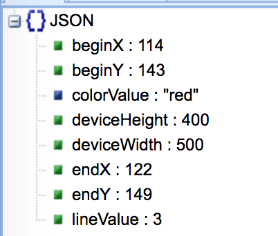
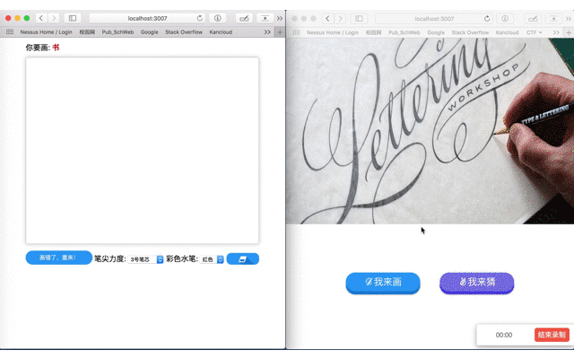
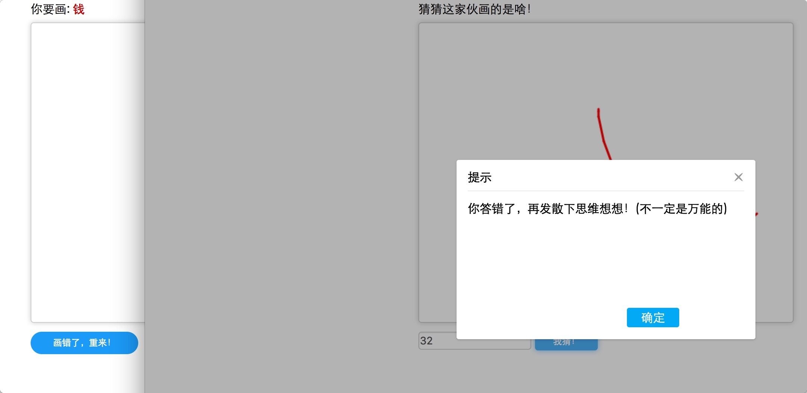
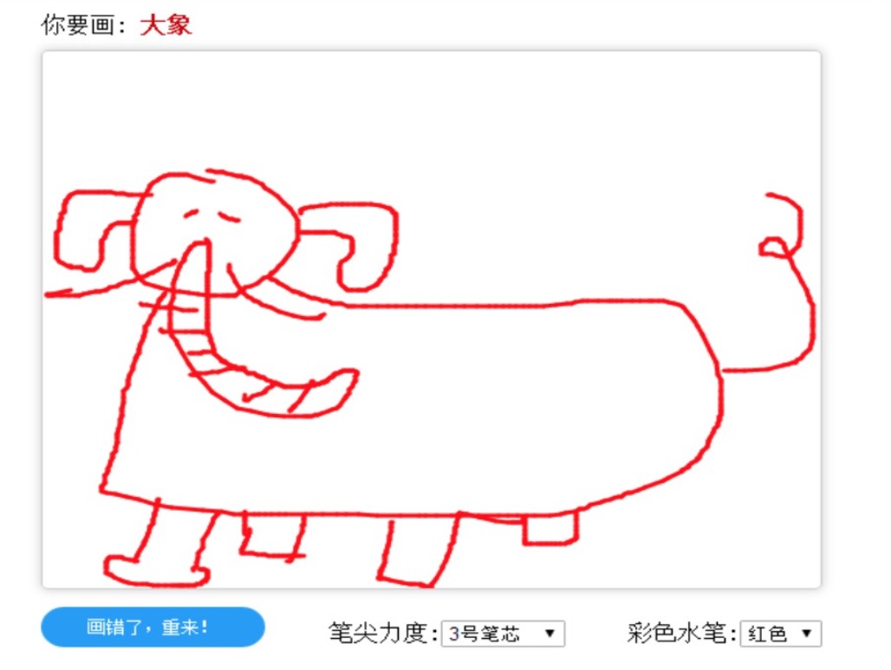
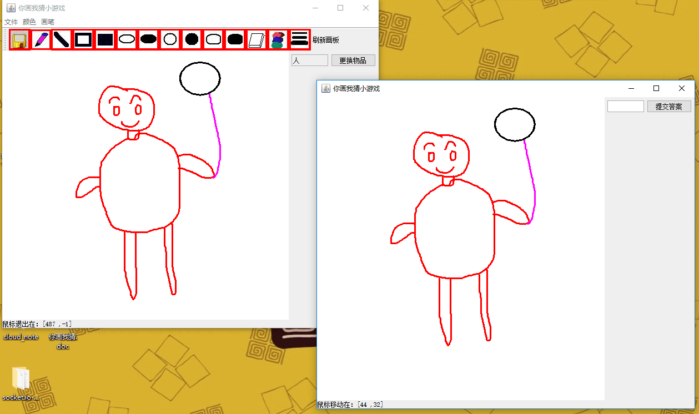
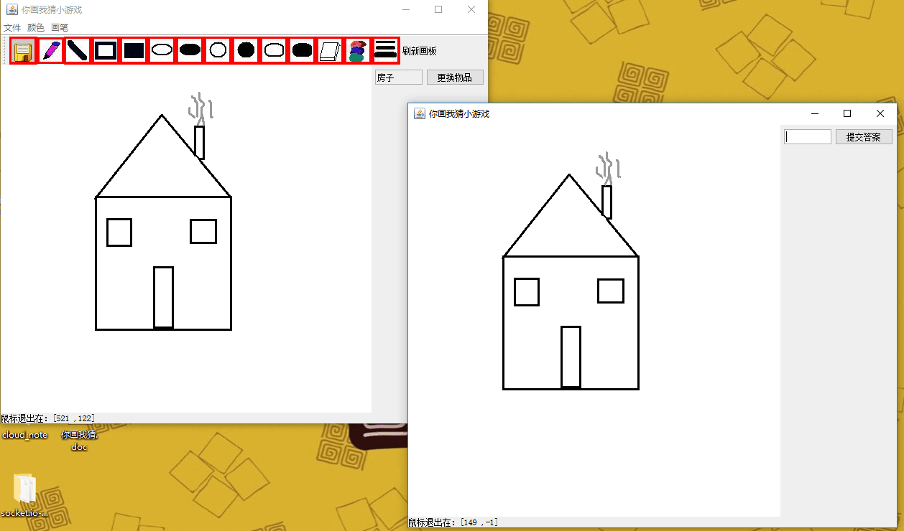
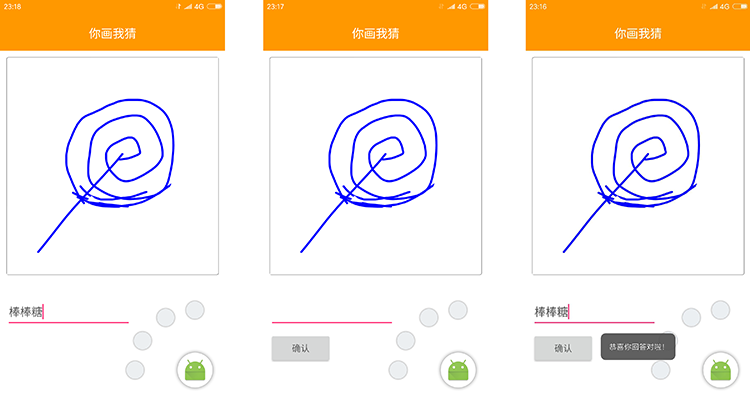

# 多终端(Java端、安卓端、Web端)你猜我画小游戏V1.0

## 项目概述

-----------

>Java课大作业，做一个小游戏，三人Git协作，不同终端，一个分支三个文件夹互不影响


### 原理图
当玩家1在使用画笔在画板上进行绘图工作时，把当前这个玩家的绘图的数据传递到服务器，然后由服务器把该数据广播到其他玩家，其他玩家的画笔将根据这些数据自动在画板上进行绘制。


### 所使用的技术及人员分配
* PC端: Java_GUI画图板 
* 安卓: Android_画图API 
* Web: Canvas 画图API
* 服务器端：Socket服务器编写
* UI: 界面设计


## Socket服务器端(数据交互)

-----------
服务器地址：


服务端关键代码：

```javascript

// socket监听的事件

// socket监听的事件
io.on('connection', function(socket) {
    /**
     * 画者事件 drawPath
     * 传入JSON：data
     * 例：
     *  {
            beginX: 68
            beginY: 182
            colorValue: "red"
            deviceHeight: 400
            deviceWidth: 500
            endX: 74
            endY: 181
            lineValue: 3
     *  }
     */
    socket.on('drawPath', function(data) {
        /**
         * 广播事件 showPath
         * 将画者事件接收的data数据，向连接到socket服务器的客户端(猜者)进行广播
         * 例：
         * socket.on('showPath', (data)=>{
                // 自定义画的方法
                this.drawing({json});
            });
         * 
         */
        socket.broadcast.emit('showPath', data);
    });


    // 监听客户端的socket.send(message)方法
    socket.on('message', function(message){
        // 画者生成一个随机的关键字
        if(message == 'getKeyWord'){
            INDEX = Math.floor(Math.random() * keyword.length);
            KEYWORD = keyword[INDEX];
            // 将生成的关键字发送到画者的客户端
            socket.emit('keyword', KEYWORD);
            
        // 画者清空画布 socket.send('clear')    
        }else if(message == 'clear'){
            // 猜者端清空画布
            console.log('进来了');
            socket.broadcast.emit('showBoardClearArea');
            // socket.emit('showBoardClearArea');
        }else if(message == 'success'){
            // 猜对后，清空画布，更换词
            io.sockets.emit('successClearArea');
        }
    }); 
    
    
    
    /**
     * 猜者提交 submit
     * 传入str: keyword
     * 
     * this.state.socket.emit('submit', keyword)}
     */
    socket.on('submit', function(keyword) {
        // 标志位
        var bingo = 0;
        // 提示
        var tip = '';
        // 如果
        console.log(keyword);
        if(keyword && KEYWORD){
            if (KEYWORD.toLocaleLowerCase() == keyword.toLocaleLowerCase()) {
                console.log('进来了2');
                bingo = 1;
            }else{
                tip = tips[INDEX];
            }
        }else{
            bingo = -1;
        }
        console.log(bingo);
        console.log(tip);

        // 将flag标志位传到连接的客户端
        socket.emit('answer', {
            bingo:bingo,
            tip:tip
        });
    });


    socket.on('disconnect', function() {});
});

```

传入数据：

```json
{
  "beginX":114,   // 起点坐标(int) X
  "beginY":143,	  // 起点坐标(int) Y
  "colorValue":"red",  // 线的颜色(str)  (#FFA500，orange，rgb(255, 165, 0))
  "deviceHeight":400,  // 设备高度(int)  
  "deviceWidth":500,   // 设备宽度(int)  
  "endX":122,          // 终止坐标(int) X
  "endY":149,		   // 终止坐标(int) Y
  "lineValue":3		   // 线的宽度(int)
}

```




## 效果图

### Web端







###  PC端




### 安卓


-----------


